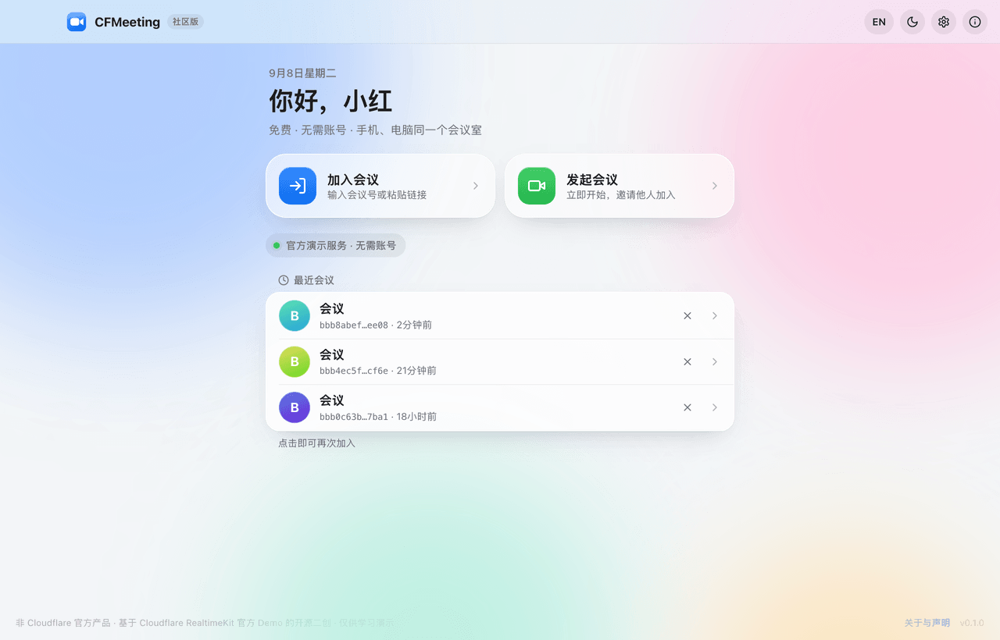
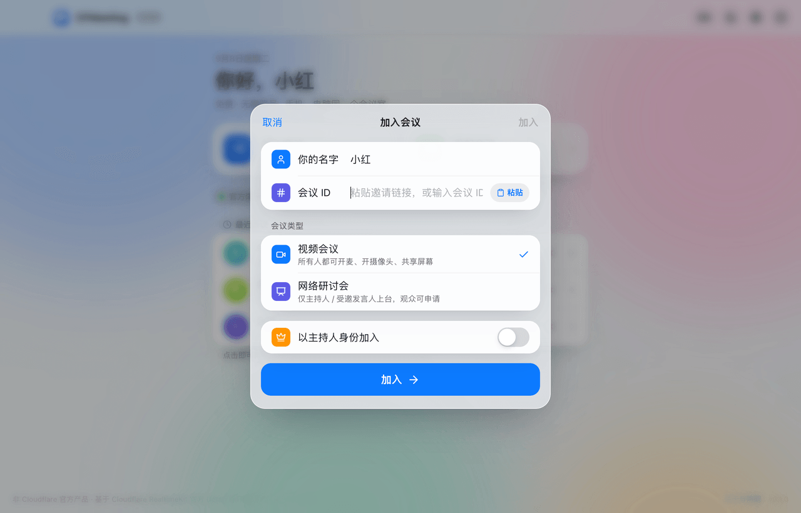
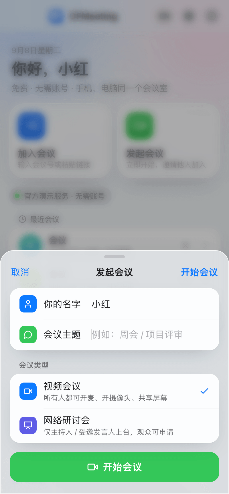
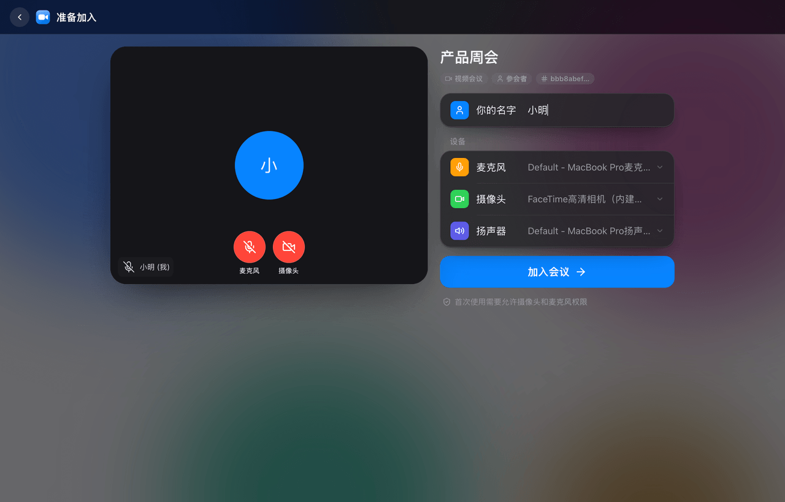
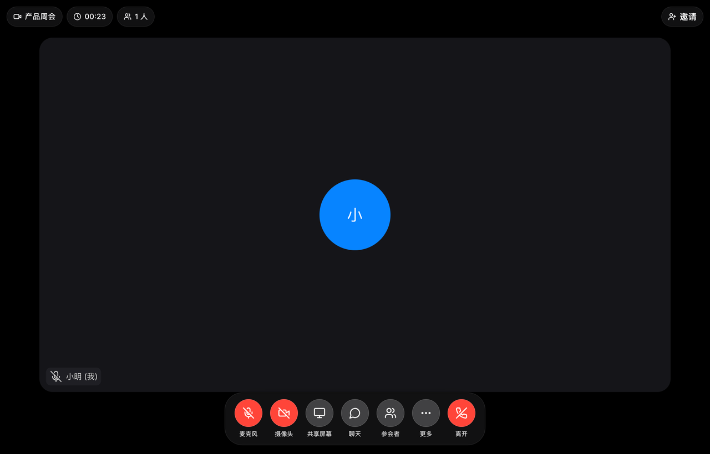
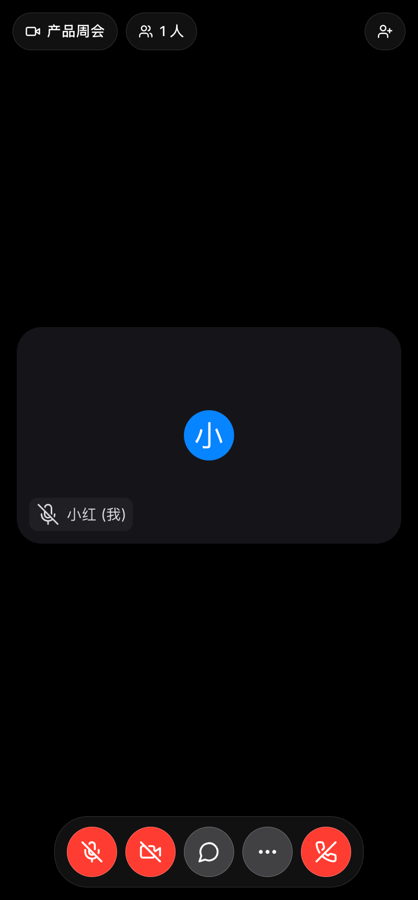

# CFMeeting

> 一个"类腾讯会议"形态的**开源视频会议演示应用**，基于 Cloudflare RealtimeKit 官方 Demo（<https://demo.realtime.cloudflare.com>）二次创作。
> 支持 **Windows / macOS**（Electron）、**Android**（APK）、**iOS**（PWA 添加到主屏幕）和网页。
>
> English summary: see [README.en.md](README.en.md).

## ⚠️ 重要声明 / Disclaimer

- **本项目不是 Cloudflare 官方产品**，与 Cloudflare, Inc. 没有隶属、合作或背书关系；它是社区对 Cloudflare RealtimeKit 官方 Demo 的二次创作（衍生作品）。
- **默认模式不需要你准备任何服务器或 Cloudflare 账号**：会议直接由 Cloudflare 公开的演示服务创建和承载。这意味着会议运行在 Cloudflare 的演示账号下，**没有任何隐私、可用性或数据保留承诺**，Cloudflare 随时可能限流、调整或关闭该演示服务。
- 请仅用于**学习、测试与演示**，不要用于任何敏感、商业或重要的会议。
- 会议能力与会议内界面来自 **Cloudflare RealtimeKit SDK / UI Kit**（Apache-2.0）。本项目自身代码以 **MIT** 协议开源。完整的第三方声明见 [NOTICE.md](NOTICE.md)。
- Cloudflare、RealtimeKit 是 Cloudflare, Inc. 的商标；"腾讯会议"是腾讯公司的商标，仅用于描述产品形态类比，本项目与腾讯无关。

同样的声明也内置在应用的"关于"对话框和页脚中。

## 它长什么样

| 首页（桌面） | 加入会议 | 发起会议（手机） |
|---|---|---|
|  |  |  |

| 会前准备 | 会议中（桌面） | 会议中（手机） |
|---|---|---|
|  |  |  |

- iOS 风格的浅色毛玻璃界面（也有深色模式）：首页问候 + 两个动作卡片 + 最近会议列表，表单以 iOS 弹层 / 底部抽屉呈现。
- 会前准备页与会议室是用 RealtimeKit UI Kit 的零件自行拼装的（`RtkUiProvider` + `RtkGrid` / `RtkSidebar` / `RtkDialogManager` 等）：FaceTime 式的悬浮玻璃控制条、顶部信息胶囊、设备选择、等候室、网络研讨会的申请上台，并叠加了**简体中文语言包**。宫格视图、共享屏幕、聊天、参会者管理、投票、等候室、分组讨论、录制等能力与官方 Demo 一致。
- 支持 **视频会议**（所有人可开麦开摄像头）和 **网络研讨会**（仅主持人 / 受邀发言人上台）两种类型，对应官方 Demo 的 Conferencing / Webinar。
- 邀请：会议 ID、应用内链接、以及**任何人都能用浏览器直接打开的官方 Demo 加入链接**。

## 三种运行模式

| 模式 | 适用平台 | 需要什么 | 说明 |
|---|---|---|---|
| **官方演示服务直连**（默认） | Windows / macOS 桌面版、Android APK | 什么都不需要 | 桌面和安卓壳不受浏览器跨域限制，直接调用 demo.realtime.cloudflare.com 的接口创建 / 加入会议，会议界面在本地渲染（中文）。 |
| **纯静态网页（内嵌官方页面）** | 网页版、iOS 主屏幕轻应用 | 什么都不需要（静态托管即可） | 浏览器无法跨域调用演示接口，因此"加入会议"时把官方页面（英文）内嵌进来；"发起会议"在官方页面创建后粘贴链接生成邀请。 |
| **自托管服务**（可选） | 所有平台 | 一个免费的 Cloudflare Workers 账号 | 部署 `apps/server`，网页 / iOS 也能获得完整本地界面；可选 9 位会议号、主持人密钥，还可以改用你自己的 RealtimeKit 凭据。见 [docs/DEPLOY.md](docs/DEPLOY.md)。 |

应用会自动判断模式：桌面 / 安卓 → 直连；网页 → 若同源存在 `/api/health` 则自托管，否则内嵌；设置里填写了"服务器地址"则始终走自托管。

## 快速开始

### 环境

- Node.js **22**（仓库带 `.nvmrc`，`nvm use` 即可）
- 桌面打包：无额外依赖（electron-builder）
- Android：Android Studio（自带 JDK 21 与 SDK）
- 不需要 Cloudflare 账号

```bash
git clone https://github.com/qianyubtc/cfmeeting.git && cd cfmeeting
nvm use            # Node 22
npm install
```

### 网页版（开发）

```bash
npm run dev        # http://localhost:5173
```

不启动服务端时网页处于"内嵌官方 Demo"模式。想在浏览器里体验完整本地界面，另开一个终端运行可选服务端（本地默认 `DEMO_PROXY=true`，不需要任何凭据）：

```bash
npm run dev:server # http://localhost:8787，Vite 会把 /api 代理过去
```

### Windows / macOS 桌面版

```bash
npm run desktop:dev      # 用 Vite 开发服务器运行 Electron
npm run desktop:build    # 打包：apps/desktop/release/ 下生成 dmg / zip / exe
```

- macOS 下共享屏幕会弹出系统选择器（macOS 15+）或应用内选择器；Windows 可同时共享系统声音。
- 打包产物**未签名**：macOS 首次打开需在"系统设置 → 隐私与安全性"中允许，或右键"打开"；Windows SmartScreen 会提示。要签名请给 electron-builder 配置证书。

### Android APK

```bash
export JAVA_HOME="/Applications/Android Studio.app/Contents/jbr/Contents/Home"   # macOS 示例
export ANDROID_HOME="$HOME/Library/Android/sdk"
npm run android:build    # apps/android/android/app/build/outputs/apk/debug/app-debug.apk
```

或 `npm run android:sync && npx cap open android` 用 Android Studio 打开工程编译。Android WebView 不支持 `getDisplayMedia`，因此安卓端只能观看他人共享、不能发起共享。

### 网页版（纯静态，零后端）

网页版就是 `apps/web/dist` 这堆静态文件，放到 **Cloudflare Pages / GitHub Pages / 任意静态空间** 即可，不需要任何后端。推荐用下文的 Cloudflare Pages 方案（主页 + `/app/` 网页版一起发布）；仓库也自带 `.github/workflows/pages.yml`，在仓库 Settings → Pages 选择 "GitHub Actions" 后可发布到 `https://qianyubtc.github.io/cfmeeting/`。

浏览器有跨域安全限制，静态网页不能直接调用官方演示接口，所以网页版的做法是：

- **加入会议**：输入会议号 / 粘贴链接后，会议在内嵌的官方页面里进行（功能完整，界面为英文），顶栏有"邀请"（会议 ID、链接、二维码）。
- **创建会议**：两步 —— ① 在新标签页打开官方页面创建（会直接进入会议）；② 把地址栏链接粘贴回来，生成邀请二维码并记入"最近会议"。
- **iOS**：用 Safari 打开网页版 → 分享 → 添加到主屏幕，即 iOS 轻应用。

桌面版和安卓版不受跨域限制，所以它们直连官方接口、使用完整的本地界面；网页版加入的会议和它们是同一个会议室。

> 可选：如果你自己愿意在 Cloudflare 上跑一个免费的转发 Worker（`apps/server`，零凭据），网页版也能用完整的本地界面，见 [docs/DEPLOY.md](docs/DEPLOY.md)。这一步完全可选，默认不需要。

### iOS（添加到主屏幕的轻应用）

用 Safari 打开网页版（GitHub Pages 地址）→ 分享 → **添加到主屏幕**。iOS 不支持发起屏幕共享。

### 项目主页 / 下载页（Cloudflare Pages）

`site/` 是纯静态的项目主页 + 下载页，同一个 Pages 项目还会在 `/app/` 子路径托管网页版：

1. `site/config.js` 里的 `repo` 指向本仓库，下载按钮会自动从 GitHub Releases 拉最新版本的各平台安装包。
2. Cloudflare 仪表盘 → Workers & Pages → Create → Pages → Connect to Git → 选这个仓库，构建设置：
   - Build command：`npm run build:site`
   - Build output directory：`site`
   - 环境变量：`NODE_VERSION=22`
3. 保存后每次推送 main 自动发布，得到 `https://cfmeeting.pages.dev`（主页）和 `https://cfmeeting.pages.dev/app/`（网页版）。可在 Pages 项目里绑定自定义域名。

本地预览：`npm run build:site && npm run site:dev`（<http://localhost:4173>）。也可以不走 Git 集成，用 `.github/workflows/site.yml` 通过 wrangler 部署。

### 一键多平台构建（GitHub Actions）

推送 `v*` 标签或手动触发 `.github/workflows/build.yml`，会产出 macOS dmg/zip、Windows 安装包和 Android APK，并自动创建 GitHub Release。

## 项目结构

```
apps/
  web/       Vite + React 网页应用 / PWA；会议界面用 @cloudflare/realtimekit-react-ui
  desktop/   Electron 壳（权限、屏幕共享选择器、跨域请求代理）
  android/   Capacitor 壳（android/ 为生成的原生工程）
  server/    可选：Cloudflare Worker（Hono）。DEMO_PROXY 转发官方演示接口，或用自己的 RealtimeKit 凭据
docs/        部署、构建与架构说明
site/        项目主页 + 下载页（Cloudflare Pages），构建后 /app/ 内含网页版
scripts/     图标生成、本机预览、站点构建脚本
NOTICE.md    第三方声明与二次创作说明
```

## 已知限制

- 依赖 Cloudflare 演示服务的可用性与策略；会议 ID 为 UUID（自托管 + KV 才有 9 位会议号）。
- 演示服务下没有"主持人密钥"：任何知道会议 ID 的人都可以在"高级选项"里以主持人身份加入（官方 Demo 亦如此）。自托管模式有 HMAC 主持人密钥。
- 录制、AI 摘要等付费能力在演示模式下不开放。
- iOS / Android 不能发起屏幕共享；macOS / Windows 桌面版可以。

## 许可证

本仓库代码：MIT（见 [LICENSE](LICENSE)）。第三方组件与商标声明：见 [NOTICE.md](NOTICE.md)。
